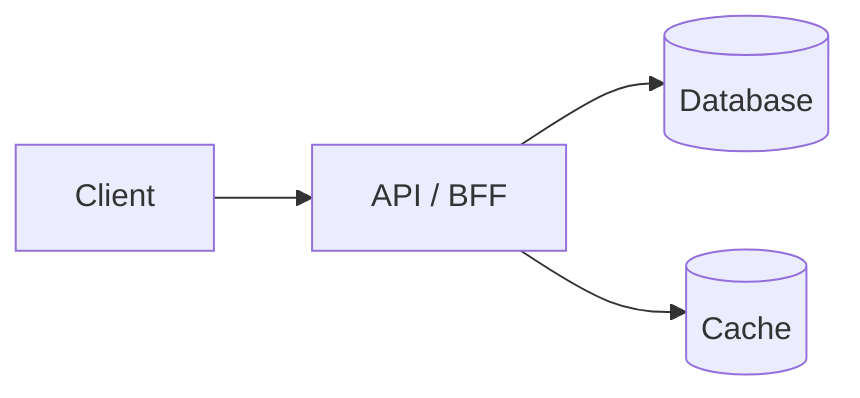

# Design — {{TITLE}}

## 1. Requirements recap
<!-- 3–5 bullets from README.md that the design must satisfy. -->

## 2. API / interface
<!-- Endpoints or component API, with request/response shapes. -->

## 3. Data model
<!-- Entities, keys, indexes; where each lives (SQL, NoSQL, cache, client store). -->

## 4. High-level architecture

## 5. Deep dives
<!-- Pick the 2–3 hardest parts and go deep: consistency, real-time, pagination, offline, performance. -->

## 6. Tradeoffs and alternatives
| Decision | Chose | Alternative | Why |
|---|---|---|---|
| | | | |

## 7. What breaks at 10× scale
